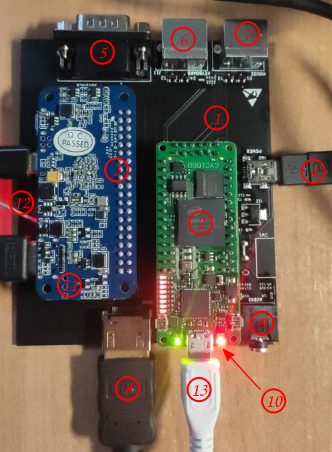

# PROYECTO ATLAS

La placa ATLAS se diseña con el objetivo de crear un multicore basado en SBC (SINGLE BOARD COMPUTER).

Inicialmente la placa adaptadora ATLAS es un proyecto para la placa CYC1000 y la SBC Raspberry Pi.

Mas info y fotos en este [hilo](http://www.forofpga.es/viewtopic.php?f=28&t=376&p=1548#p1548), en su propio [foro](http://www.forofpga.es/viewforum.php?f=240&sid=bd3e070f65599ff111ad0494e4459535) de foroFPGA, en [telegram](https://t.me/CYC1000) o [discord](https://discord.gg/YDdmtwh).

### Guía rápida

Si ya tienes tu CYC1000, una raspberry Pi, y la placa ATLAS (la puedes conseguir en el grupo de [telegram](https://t.me/CYC1000)), sigue esta guía rápida para empezar a trastear. 

El proyecto está empezando y se irán simplificando los pasos en el futuro de forma que para cargar los cores ya no será necesario acceder al terminal de Linux de la placa SBC.

#### Ensamblaje de las placas:



Leyenda: (1) Placa Atlas, (2) FPGA CYC1000, (3) SBC Raspberry Pi, (4) Alimentación general, (5) DB9 para joystick, (6) teclado PS2, (7) ratón PS2, (8) salida video HDMI, (9) jack 3.5 audio, (10) tarjeta microSD ATLAS, (11) tarjeta microSD rPi

Otras conexiones opcionales: 

(12) Conexiones de vídeo y teclado a la SBC rPi para acceder al terminal de linux . No es necesario si has configurado acceso ssh por WiFi.

(13) USB Blaster para cargar cores directamente a la CYC1000. No es necesario si la carga se hace a través de la SBC rPi.

#### Configuración inicial de la SBC raspberry Pi

* Descarga raspberry Pi OS Lite https://www.raspberrypi.org/software/operating-systems/ y grábalo en una tarjeta micro SD
* Arranca  la SBC con la tarjeta micro SD del paso anterior en el zócalo (11) (no es necesario tenerla conectada aún a la placa ATLAS) con el video y teclado conectados y con un cargador de adecuado amperaje (>2A). 
  * Para acceder al terminal Linux de la rPI el usuario / contraseña por defecto son: pi / raspberry
* Configuración de la raspberry Pi con el comando `sudo raspi-config` (la configuración del WiFi es opcional y puedes encontrar mas información [aquí](https://www.raspberrypi.org/documentation/configuration/wireless/wireless-cli.md)): 
  * 5 Localization Options
    * L4 WLAN country 
    * L3 keyboard
  * 1 system options
    * S1 wireless LAN

#### Instalación del cargador de cores programRBF en la FPGA 

Nota: vamos a trabajar desde el directorio /home/pi que es el que aparece por defecto al arrancar el terminal Linux con el usuario "pi".

* Instala la librería WiringPi:

  ```
  wget https://project-downloads.drogon.net/wiringpi-latest.deb
  sudo dpkg -i wiringpi-latest.deb
  ```

* Compila el ejecutable para cargar los cores:

  ```
  wget https://raw.githubusercontent.com/shaeon/programrbf/main/programrbf_v01.cpp
  g++ programrbf_v01.cpp -lwiringPi -o programrbf
  ```

#### Arranca los cores desde el terminal Linux de la SBC

* Copia los cores con extensión .rbf a la tarjeta SD, en la partición "rootfs", directorio ""/home/pi".

* Carga el core con el ejecutable programrbf (el ejemplo carga el [msx_multicore2.rbf](./cores/msx_multicore2.rbf) de MSX1):

  ```
  ./programrbf msx_multicore2.rbf 17 22 4 27
  ```
  
  Nota: El core [msx_multicore2.rbf](./cores/msx_multicore2.rbf) de MSX1 requiere soldar un reloj adicional de 50 MHz, y tener una tarjeta micro SD con [este contenido](https://mega.nz/file/20pi1aiY#FwhOZryEUyuyU1gEUCVma1ndn-2BqtvH7RUx-qwgqs0) insertada en el zócalo micro SD (10) de la placa ATLAS.

#### Script para cargar un core automáticamente al arrancar la SBC

* Ejecuta los siguientes comandos en el terminal de Línux:

  ```sh
  crontab -e
  #selecciona por ejemplo nano y al final del fichero cron añade lo siguiente:
  @reboot ~/programrbf msx_multicore2.rbf 17 22 4 27
  ```


### **Reloj adicional de 50 Mhz:**

La placa CYC1000 dispone de un reloj de 12 Mhz. Algunos cores necesitan de un reloj adicional de 50 MHz a soldar en el espacio que se ve en la siguiente [foto](http://www.forofpga.es/viewtopic.php?f=240&t=390).

Dónde conseguir el reloj:

* [Arrow](https://www.arrow.com/en/products/ecs-2520mv-500-bn-tr/ecs-international?q=ECS-2520MV-500-BN-TR)

Listado de cores que van a 50 MHz:

* MSX1

### **Colaboraciones:**

Se necesita la [colaboración](https://github.com/SoCFPGA-learning/General/tree/main/Github_ayuda) para poder incrementar los recursos disponibles para la comunidad entorno esta placa de desarrollo.    

### Comunidad:

* [Telegram group](https://t.me/CYC1000) 
* [Discord channel](https://discord.gg/YDdmtwh) 